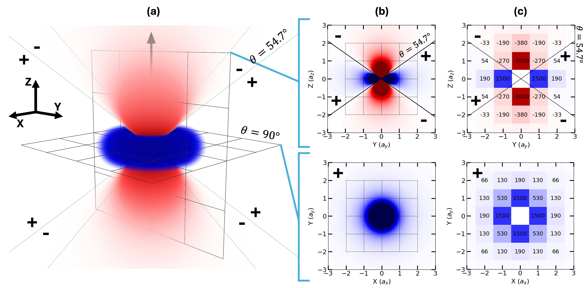
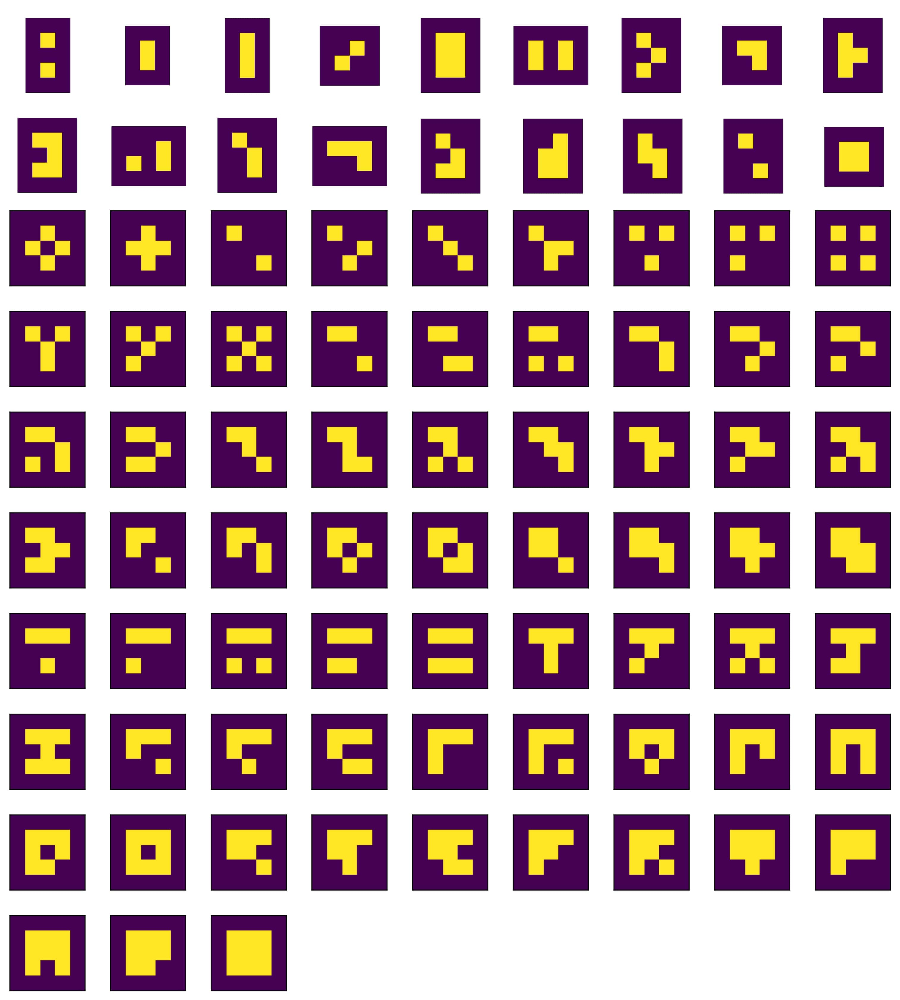
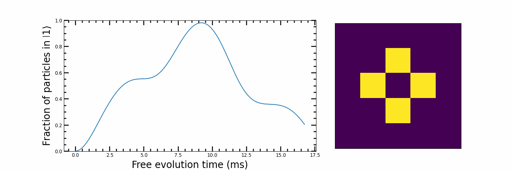
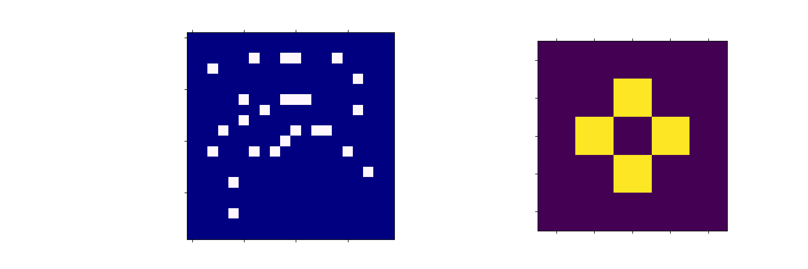
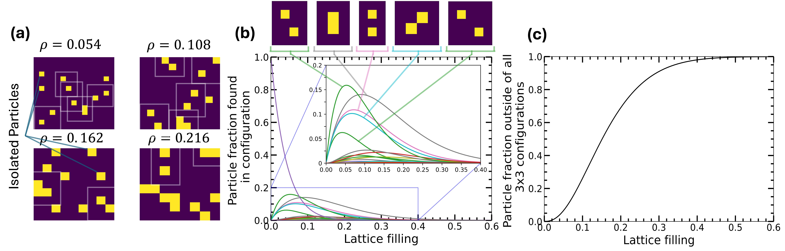
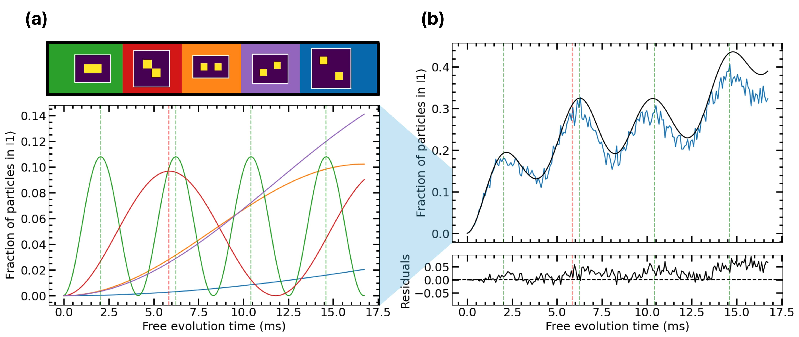
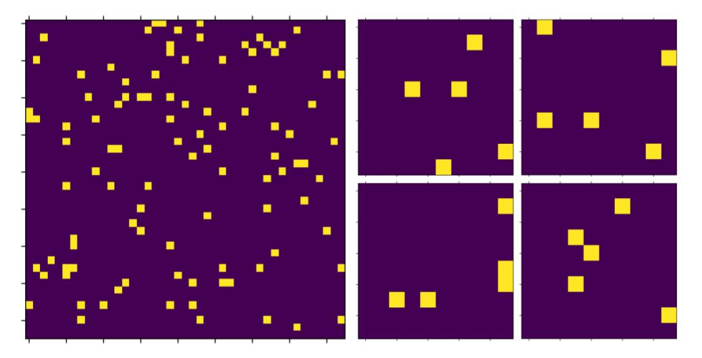
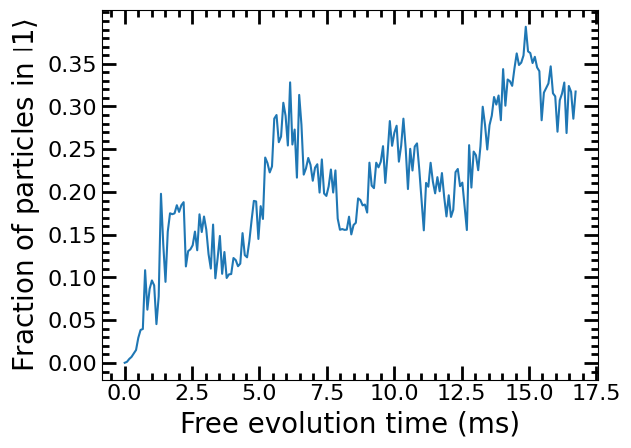

<a id="readme-top"></a>


<h1 align="center">Simulating a Quantum Simulator</h1>


  <p align="center">
    A toolkit to simulate the pseudo-spin interactions of dipolar molecules pinned in a lattice
    <br />
    <a href="#pseudo-spin-interactions">See Visualizations</a>
    &middot;
    <a href="https://github.com/J-Coward/DipolarSpin/issues/new?labels=bug&template=bug-report---.md">Report Bug</a>
    &middot;
    <a href="https://github.com/J-Coward/DipolarSpin/blob/main/Simulating_a_Quantum_Simulator.pdf">Project Report</a>
  </p>
</div>


<!-- TABLE OF CONTENTS -->
<details>
  <summary>Table of Contents</summary>
  <ol>
    <li>
      <a href="#about-the-project">About The Project</a>
      <ul>
        <li><a href="#built-with">Built With</a></li>
      </ul>
    </li>
    <li>
      <a href="#getting-started">Getting Started</a>
      <ul>
        <li><a href="#prerequisites">Prerequisites</a></li>
        <li><a href="#installation">Installation</a></li>
      </ul>
    </li>
    <li><a href="#Pseudo-Spin_Interactions">Pseudo-Spin Interactions</a></li>
    <li>
      <a href="#usage">Usage</a>
      <ul>
        <li><a href="#constituent-method">Constituent Method</a>
        <li><a href="#sampling-method">Sampling Method</a>
      </ul>
    </li>
    <li><a href="#contact">Contact</a></li>
    <li><a href="#acknowledgments">Acknowledgments</a></li>
  </ol>
</details>


<!-- ABOUT THE PROJECT -->
## About The Project


This project focuses on simulating the dynamics of 2D spin models with large distributions of particles. In particular, we consider our simulations in the context of an analogue quantum simulator built with dipolar RbCs molecules which can mirror spin interactions with their dipoles. While we present the interactions created by RbCs molecules, the physical considerations and methods to realize such a system are not mentioned in this project, however in my <a href="https://github.com/J-Coward/DipolarSpin/blob/main/Simulating_a_Quantum_Simulator.pdf">written report</a> I give an outline of the quantum simulator and reference relevant more detailed works.


We present two methods for simulating large spin models (further explained in <a href="#usage">`Usage`</a>):


 * The <a href="#constituent-method">`Consitiuent Method`</a>, designed by me, which simulates all particle configurations possible for a 3x3 lattice under the specified conditions then sums the results, weighted according to each configuration's relevance to the larger distribution, for the overall dynamics.
 * The <a href="#sampling-method">`Sampling Method`</a>, used in <a href="https://www.nature.com/articles/s41586-022-05558-4">previous work</a>, which simulates smaller random samples of the overall distribution and takes the average output.


The examples and functions provided favour uniform distributions of particles giving analytical solutions, however included are numerical tools which handle other more complex distributions. These include functions to generate samples of some distribution then count the frequency of each 3x3 particle configuration within to estimate the overall composition of the distribution for the weighted sum in the constituent method.


<p align="right">(<a href="#readme-top">back to top</a>)</p>


### Built With


* <a href=https://quspin.github.io/QuSpin>`QuSpin`</a>
* <a href=https://numpy.org>`Numpy`</a>
* <a href=https://matplotlib.org>`Matplotlib`</a>
* <a href=https://docs.python.org/3/library/random.html#module-random>`random`</a>
* <a href=https://scipy.org>`Scipy`</a>
* <a href=https://docs.python.org/3/library/time.html>`time`</a>


<p align="right">(<a href="#readme-top">back to top</a>)</p>


<!-- GETTING STARTED -->
## Getting Started


To copy this project locally follow these steps.


### Prerequisites


Ensure you have properly downloaded the relevant modules listed in <a href="#built-with">`Built With`</a> for your work/the functions you wish to use.


### Installation


To install the tools developed in this work without any surplus files which are not necessary, please download the specially organized **Installation** branch.


   ```sh
   git clone https://github.com/J-Coward/DipolarSpin.git --branch Installation
   ```


This ensures you only clone the important tools in <a href="https://github.com/J-Coward/DipolarSpin/blob/main/core_functions.py">*'core_functions.py'*</a>, <a href="https://github.com/J-Coward/DipolarSpin/blob/main/generate_grid_permutations.py">*'generate_grid_permutations.py'*</a> and <a href="https://github.com/J-Coward/DipolarSpin/blob/main/Examples/auxilary_functions.py">*'auxilary_functions.py'*</a>. Additionally, every 3x3 particle configuration orbit *'Orbits.pickle'* (the result of 'generate_grid_permutations.py'), is included.


Note, we also included *'Orbit_Ramseys.pickle'* in the installation as a more specific result (Ramsey measurements of each orbit under isotropic 1500Hz nearest neighbor interactions over ~20ns timescale) due to its use, relevance and time to generate.


Once you have installed as demonstrated, please see <a href="https://github.com/J-Coward/DipolarSpin/blob/main/Examples">`Examples`</a> and <a href="#usage">`Usage`</a> for demonstrations of the code.


<p align="right">(<a href="#readme-top">back to top</a>)</p>


<!-- BACKGROUND  -->
## Pseudo-Spin Interactions


The core of this project is simulating the interactions between particles. Specifically, we are concerned with the dipole-dipole interactions between polar molecules prepared as pseudo-spin interaction.


Importantly, polar molecules can create anisotropic interactions when their quantization axes are not orthogonal to our 2D plane of particles. We can orient molecules with a magnetic field thus tuning the anisotropy as desired. These features are included in this project where the quantization axis can be defined through the variables `theta` and `psi`.


We can graph the 3D interaction strength around a polar molecule and project its 2D interaction on different planes to illustrate the different interactions we can create and simulate.


<a id='Interactions'></a>


<p align="right">(<a href="#readme-top">back to top</a>)</p>


<!-- USAGE EXAMPLES -->
## Usage


Here I briefly describe the two methods used and compared in this project. The parameters for our examples were chosen to be simplistic and similar to experimental values for clarity and utility and the output parameter (fraction of particles in the up state) is readily accessible experimentally. They concern a Ramsey measurement performed on a uniform distribution of particles with a lattice filling of 0.054 and 1500Hz nearest neighbor isotropic interactions. Finally, all our simulations start with all particles in the ground/down state.


### <a href="https://github.com/J-Coward/DipolarSpin/blob/main/Examples/Constituent_method.ipynb">Constituent Method</a>


This method leverages the dominant dynamics of small configurations of particles at low quantum correlations (low density of particles, short evolution times) to estimate the overall evolution of a quantum spin model without noise or multiple samples. Here I briefly describe this method which is further explained and illustrated in the <a href="https://github.com/J-Coward/DipolarSpin/blob/main/Examples/Constituent_method.ipynb">`Constituent Method Example`</a> or my <a href="https://github.com/J-Coward/DipolarSpin/blob/main/Simulating_a_Quantum_Simulator.pdf">`project report`</a>. All the examples in this project simulate a **Ramsey measurement** (which can be changed while retaining valid results) on particles with a **low 2D lattice filling** in a **uniform distribution** in a **square** 2D lattice.


Firstly, we find the relevant small configurations. Here we use all possible configurations of particles in a 3x3 grid accounting for the vast majority of the low density uniform distribution. Since we are treating the dynamics of each configuration as *independant* they must be sufficiently *isolated* which is incorporated by padding each particle configuration with a layer of empty sites. Also, since **rotations** of each configuration will have the same results (we have isotropic interactions) we group the configurations into **orbits** such that only a **representative** from each must be simulated.


**For completeness, in the examples in this project we simulate the dynamics of *every* 3x3 particle configuration however at the regimes we study only a few configurations make significant contributions to the final result (generally these are various pairs) therefore we could neglect the more complex, resource heavy configurations with a minimal accuracy decrease.**


All this is done within `generate_grid_permutations.py` and the result is saved as `Orbits.pickle` for use. The representatives for each orbit are:





Now we simulate each representative, according to our specified parameters, to find the dynamics of each orbit. For these examples, we implement a Ramsey pulse sequence, an interaction strength between nearest neighbors of 1500\,Hz and a quantization axis orthogonal to the 2D plane of particles (isotropic interactions). We can display the interactions as a **interaction matrix** in at the bottom of (c) in the <a href='#Interactions'>`interaction graph`</a>. This results in 84 (excluding the isolated particle which has no interactions) Ramsey measurements for each orbit:





Next we must find the proportion of the overall uniform distribution consisting of each particle configuration, allowing us to sum their individual dynamics according to their significance. For an arbitrary distribution we can estimate this numerically with a convolution (as used in machine learning) of samples of the larger distribution with the particle configurations as the kernels. This scans every lattice point of each sample for the presence of each 3x3 configuration then averages the overall proportion of particles found in the pattern. The animation below illustrates this process for a random sample of a uniform distribution with a 0.1 lattice filling.





*Importantly the animation above shows the error in this numerical method, where some particles are counted multiple times and some not at all. We can quantify this somewhat by calculating the particles left over after our calculation which generally shows that for 3x3 particle configurations in a low lattice filling large distribution this method gives a good estimate.*
 
For a uniform distribution we can simplify this by considering the probability each particle configuration appears at each lattice point. This leads to an equation for the proportion of particles in each orbit, f, dependant on the size of the orbit, S, number of occupied sites , o, number of empty sites, e, and lattice filling, $\rho$:


```math
f = S(1-\rho)^{e}\rho^{o-1}
```
With this, we can graph the 3x3 configuration 'make up' of a uniform distribution of particles at each lattice filling and the corresponding unaccounted for particles:





Finally, we combine all the dynamics of each orbit weighted according to their frequency in the overall distribution to approximate the evolution of a large distribution of particles. For a Ramsey measurement of a uniform distribution with a lattice filling of 0.054 (achievable experimentally) evolving under 1500Hz nearest neighbor isotropic interactions we get the resulting graph:





where the weighted component dynamics are on the left and the overall results for the constituent method (black) and sampling method (blue) are on the right.


### <a href="https://github.com/J-Coward/DipolarSpin/blob/main/Examples/Sampling_method.ipynb">Sampling Method</a>


For the sampling method, we utilize many small samples of a particle distribution to represent the dynamics with an average. Critically, when sampling we change the *size* of the sample lattice rather than the number of particles due to the exponential computational resource increase for each extra particle.


Our example uses many random configurations of 5 particles in a square lattice all with 5/0.0544 ~ 92 sites to represent a 0.0544 lattice filling large uniform particles distribution. Images of the large distribution and its corresponding samples are shown below:





At each time value, we simulate the evolution of a chosen number of aforementioned samples under a Ramsey pulse with the corresponding free evolution time between pulses. Further sampling increases the accuracy and reduces the noise of the result but is more computationally intensive.


We calculate the interaction strengths between particles for each sample in the same way as the constituent method above. Using an interaction matrix centered around each particle we define each coupling. This is represented in (c) in the <a href='#Interactions'>above interaction graph</a>.


To conclude, we average the result of the samples for each point to give the overall dynamics of the large particle distribution.





<p align="right">(<a href="#readme-top">back to top</a>)</p>


<!-- CONTACT -->
## Contact


Joseph Coward - joe98.jc@gmail.com - <a href="https://www.linkedin.com/in/joseph-coward-ba2864262/?trk=opento_sprofile_goalscard">linkedin</a>


<p align="right">(<a href="#readme-top">back to top</a>)</p>


<!-- ACKNOWLEDGMENTS -->
## Acknowledgments


Thank you to my project supervisors Doctor Jonathan Mortlock and Professor Simon Cornish for their help and guidance with my work.


<p align="right">(<a href="#readme-top">back to top</a>)</p>


[QuSpin-url]: https://quspin.github.io/QuSpin/
[Numpy-url]: https://numpy.org/
[Scipy-url]: https://scipy.org/
[matplotlib-url]: https://matplotlib.org/
[random-url]: https://docs.python.org/3/library/random.html#module-random
[time-url]: https://docs.python.org/3/library/time.html